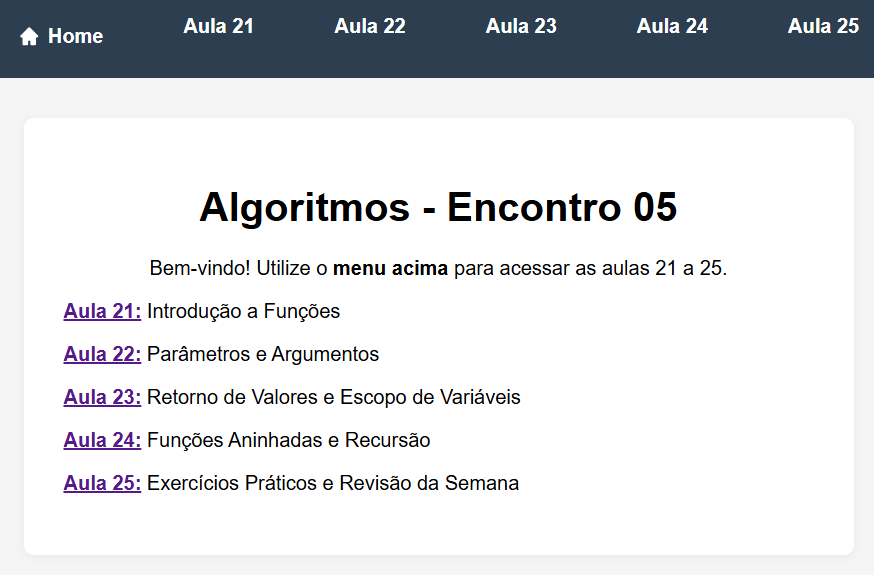

# Lista Funções - 2025

### Antes de começar:
- leia o material de apoio (aulas 21 a 24) em [link: Python - Funções](https://michelzero.github.io/Progressao-Algoritmos/encontro05/)


### resumo de uma função:
- uma função é um bloco de código que executa uma tarefa específica e pode ser reutilizado.
- as funções podem receber parâmetros (valores de entrada) e retornar valores (saída).
- as funções são definidas usando a palavra-chave `def` seguida pelo nome da função e parênteses.
- as funções podem ser chamadas pelo nome, passando os argumentos necessários.
- as funções podem ser aninhadas, ou seja, uma função pode chamar outra função.
- as funções podem ser documentadas usando docstrings, que são strings de documentação colocadas logo após a definição da função.
- as funções podem ser importadas de outros módulos usando a palavra-chave `import`.
- as funções podem ser usadas para organizar o código em blocos lógicos, facilitando a leitura e manutenção do código.
- as funções podem ser usadas para evitar a repetição de código, tornando o código mais modular e reutilizável.
- as funções podem ser usadas para abstrair a complexidade do código, permitindo que o programador se concentre na lógica do programa em vez de detalhes de implementação.
- as funções podem ser usadas para criar bibliotecas de código reutilizável, que podem ser compartilhadas entre diferentes projetos.
- as funções podem ser usadas para criar testes automatizados, que verificam se o código está funcionando corretamente.
- as funções podem ser usadas para criar interfaces de usuário, que permitem que o usuário interaja com o programa.
- as funções podem ser usadas para criar scripts, que são programas pequenos e simples que executam uma tarefa específica.
- as funções podem ser usadas para criar programas maiores e mais complexos, dividindo o código em partes menores e mais gerenciáveis.
- as funções podem ser usadas para criar programas orientados a objetos, que são baseados em classes e objetos.
- as funções podem ser usadas para criar programas funcionais, que são baseados em funções e imutabilidade.
- as funções podem ser usadas para criar programas imperativos, que são baseados em comandos e controle de fluxo.
- as funções podem ser usadas para criar programas declarativos, que são baseados em expressões e regras.
- as funções podem ser usadas para criar programas concorrentes, que são baseados em threads e processos.
- as funções podem ser usadas para criar programas distribuídos, que são baseados em redes e comunicação entre processos.
- as funções podem ser usadas para criar programas paralelos, que são baseados em execução simultânea de tarefas.

### corpo de uma função:
```python
def nome_da_funcao(parametros):
    """
    Docstring explicando a função.
    """
    # corpo da função
    return valor_de_retorno
    